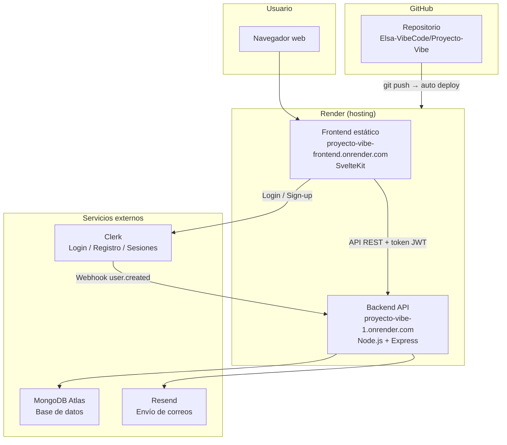
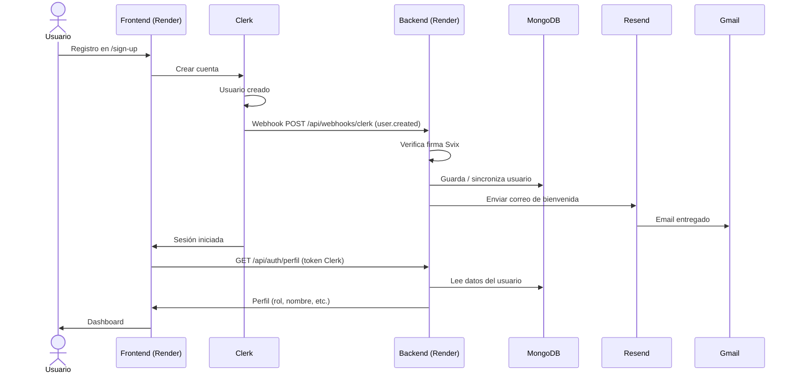
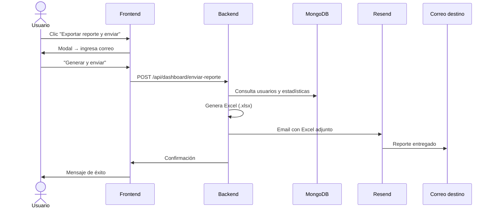
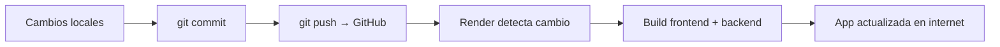

# Proyecto Vibe — Sistema de Administración

Panel de administración full-stack con **SvelteKit** (frontend), **Node.js + Express** (backend), **MongoDB Atlas**, **Clerk** (autenticación) y **Resend** (correos).

Configurado para México (`es-MX`, zona horaria `America/Mexico_City`).

## URLs en producción (Render)

| Servicio   | URL |
|------------|-----|
| Frontend   | https://proyecto-vibe-frontend.onrender.com |
| Backend API | https://proyecto-vibe-1.onrender.com |
| Repositorio | https://github.com/Elsa-VibeCode/Proyecto-Vibe |

---

## Arquitectura general



### Para qué sirve cada herramienta

| Herramienta | Función |
|-------------|---------|
| **GitHub** | Guarda el código, historial de cambios y dispara el deploy en Render al hacer `git push`. |
| **Render** | Aloja el frontend y el backend en internet. Gestiona variables de entorno en producción. |
| **MongoDB Atlas** | Base de datos: usuarios, roles, importaciones Excel y estadísticas. |
| **Clerk** | Autenticación (login, registro, sesiones). Envía webhooks al backend cuando ocurren eventos. |
| **Resend** | Envío de correos: bienvenida al registrarse y reportes del dashboard en Excel. |

---

## Flujo de registro (correo de bienvenida)



---

## Flujo de exportar y enviar reporte



---

## Flujo de desarrollo → producción



---

## Estructura del proyecto

```
Proyecto Vibe/
├── backend/              # API REST con Node.js
│   └── src/
│       ├── config/       # Conexión a MongoDB Atlas
│       ├── models/       # Modelos Mongoose
│       ├── routes/       # Rutas de la API (auth, dashboard, webhooks…)
│       ├── middleware/   # Autenticación Clerk
│       └── utils/        # Email (Resend), Excel, Clerk
└── frontend/             # Panel con SvelteKit
    └── src/
        ├── lib/          # API client, auth, componentes
        └── routes/       # Páginas (sign-in, dashboard, usuarios…)
```

## Requisitos

- Node.js 20+
- Cuentas en [MongoDB Atlas](https://www.mongodb.com/atlas), [Clerk](https://clerk.com), [Resend](https://resend.com) y [Render](https://render.com) (para producción)

## Instalación local

### Backend

```bash
cd backend
cp .env.example .env
# Edita .env con tus claves (ver sección Variables de entorno)
npm install
npm run dev     # http://localhost:3000
```

### Frontend

```bash
cd frontend
cp .env.example .env
npm install
npm run dev     # http://localhost:5173
```

> En macOS, si `npm` no se encuentra, agrega Node al PATH:
> `export PATH="/ruta/a/node/bin:$PATH"`

## Autenticación (Clerk)

El login y registro los gestiona **Clerk**. No hay pantalla de login propia.

- `/sign-in` — Iniciar sesión
- `/sign-up` — Registrarse

Al iniciar sesión, el backend verifica el token de Clerk y sincroniza el usuario en MongoDB. El correo `admin@ejemplo.com` recibe rol **admin** automáticamente al registrarse en Clerk.

### Webhook de Clerk (producción)

URL del endpoint en Clerk Dashboard:

```
https://proyecto-vibe-1.onrender.com/api/webhooks/clerk
```

Eventos suscritos: `user.created`, `email.created` (opcional).

---

## API Endpoints principales

| Método | Ruta | Descripción | Auth |
|--------|------|-------------|------|
| GET | `/api/salud` | Estado del servidor | Público |
| GET | `/api/auth/perfil` | Perfil del usuario autenticado | Clerk JWT |
| GET | `/api/dashboard/estadisticas` | Estadísticas del panel | Clerk JWT |
| GET | `/api/dashboard/exportar-excel` | Descargar reporte Excel | Clerk JWT |
| POST | `/api/dashboard/enviar-reporte` | Generar Excel y enviar por correo | Clerk JWT |
| POST | `/api/webhooks/clerk` | Webhook de Clerk (Svix) | Firma Svix |
| GET/POST/PUT/DELETE | `/api/usuarios/*` | CRUD de usuarios | Clerk JWT + rol |
| GET/POST | `/api/excel/*` | Importar y exportar Excel | Clerk JWT |

## Roles

- **admin** — Acceso completo: crear, editar y eliminar usuarios.
- **editor** — Puede ver la lista de usuarios.
- **visor** — Acceso al panel y su perfil.

## Variables de entorno

### Backend (`backend/.env`)

```env
MONGODB_URI=mongodb+srv://...
PORT=3000
JWT_SECRET=clave_secreta_segura
CORS_ORIGIN=http://localhost:5173
TZ=America/Mexico_City

# Clerk
CLERK_PUBLISHABLE_KEY=pk_test_...
CLERK_SECRET_KEY=sk_test_...
CLERK_WEBHOOK_SECRET=whsec_...

# Resend
RESEND_API_KEY=re_...
RESEND_FROM=Proyecto Vibe <onboarding@resend.dev>
```

### Frontend (`frontend/.env`)

```env
PUBLIC_CLERK_PUBLISHABLE_KEY=pk_test_...
PUBLIC_API_URL=http://localhost:3000/api
```

### Render (producción)

**Backend** (`Proyecto-Vibe-1` → Environment): todas las variables del backend.

**Frontend** (`proyecto-vibe-frontend` → Environment):

```env
PUBLIC_CLERK_PUBLISHABLE_KEY=pk_test_...
PUBLIC_API_URL=https://proyecto-vibe-1.onrender.com/api
```

---

## Despliegue en Render

1. Conecta el repositorio de GitHub a Render.
2. Crea un **Web Service** para `backend/` (`npm install` + `npm start`).
3. Crea un **Static Site** para `frontend/` (`npm install && npm run build`, publish `build`).
4. Configura las variables de entorno en cada servicio.
5. Cada `git push` a `main` redespliega automáticamente.

## Scripts disponibles

| Proyecto | Comando | Descripción |
|----------|---------|-------------|
| Raíz | `npm run dev:backend` | Backend en desarrollo |
| Raíz | `npm run dev:frontend` | Frontend en desarrollo |
| Backend | `npm run dev` | Servidor con recarga automática |
| Backend | `npm run seed` | Usuario inicial en MongoDB (legacy) |
| Backend | `npm start` | Servidor en producción |
| Frontend | `npm run dev` | Servidor de desarrollo |
| Frontend | `npm run build` | Build de producción |

## Correos con Resend

- **Bienvenida:** al crear un usuario en Clerk, el webhook dispara el envío automático.
- **Reporte del dashboard:** botón "Exportar reporte y enviar" en el panel de control.

En desarrollo con `onboarding@resend.dev`, solo se pueden enviar correos a direcciones verificadas en Resend. Para enviar a cualquier correo, verifica un dominio propio (ej. `bluewolf.com.mx`) en Resend y actualiza `RESEND_FROM`.
